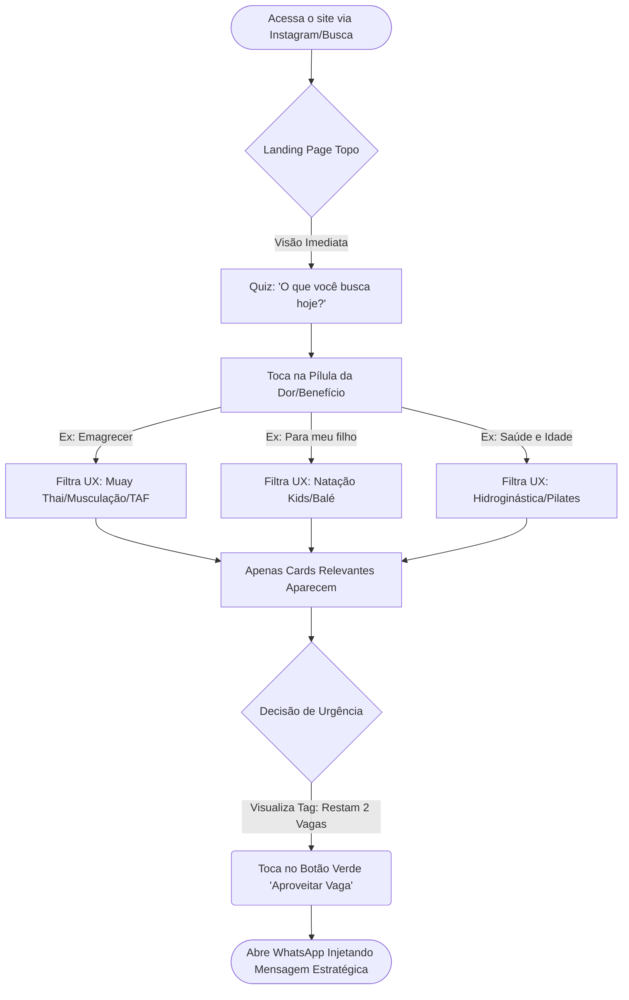
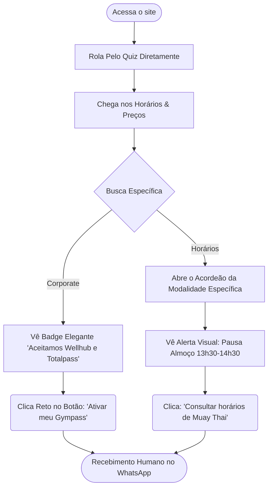

# Especificações de Design UX bellezapura-site

**Autor:** FranCILDO
**Data:** 2026-04-15

---

## Executive Summary

### Project Vision

O bellezapura-site atuará como o motor de conversão digital definitivo e sustentáculo de vendas *mobile-first* da Academia Belleza Pura. O produto tem por objetivo extrair valor persuasivo dos +30 anos de infraestrutura (a única piscina da região) mesclando informações ágeis, um catálogo dinâmico alimentado via CMS remoto (planilhas) e engrenagens de engajamento (calculadoras/quiz). Seu alvo fundamental é quebrar objeções e preencher a equipe de vendas no WhatsApp com leads altamente qualificados com o mínimo de atrito possível. 

### Target Users

1. **A Mãe Protetora (Decisora):** Procura segurança, natação infantil e desenvolvimento para os filhos fora das telas. Responde forte ao gatilho de tradição e confiabilidade. Navega geralmente pelo celular.
2. **O Executivo Estressado:** Prioriza alívio de estresse (Lutas e Cardio) fugindo do modelo tradicional focado em hipertrofia e estética intimidadora. Procura um espaço acolhedor.
3. **Morador Local Fiel:** Busca pertencimento comunitário em um centro de saúde único contrapondo-se às enormes redes automáticas *low cost*.

### Key Design Challenges

- **Tabelas Complexas no Mobile (Disclosure Progressivo):** Mais do que "condensar" a grade, o desafio é evitar a fadiga visual. A solução UX exige abandonar a metáfora de tabela e usar filtros táteis horizontais (Pills) e componentes sanfonados (Accordions), permitindo que, com um toque rápido, uma mãe isole tudo da tela e veja apenas o universo "Infantil", por exemplo.
- **Transparência vs. Curiosidade (Preço Híbrido Re-significado):** O perigo de omitir preços é causar frustração ("Deve ser caro"). O design não pode apenas "esconder". Ele precisa converter o clique do WhatsApp em um serviço de alto valor perceptível. Ocultar o preço exigirá que CTAs mudem de "Consultar Preço" para chamadas que trazem benefício imediato à dor do usuário, como: *"Desbloquear Avaliação Gratuita"* ou *"Aplicar para Vaga da Natação Kids"*.
- **Design Baseado em Planilha (Tolerância a Erro):** Como o conteúdo (CMS) vem de uma planilha manipulada pela equipe física, a interface do usuário deve possuir a premissa de *Degradação Suave*. O Design precisa prever preenchimentos incorretos pela recepção sem que a estrutura visual do site "quebre", prevendo "Fallback states" invisíveis para o usuário final.

### Design Opportunities

- **Calculadora Modular (Quiz de Valor):** Ao definir idade e objetivos, a interface aponta a melhor modalidade. Esse funil aquece a conversa: o lead já chega no WhatsApp dizendo "Fiz o teste e deu Muay Thai para aliviar estresse, posso agendar?".
- **Vitrines de Escassez Autenticada:** Mostrar etiquetas vibrantes de lotação dinâmicas na listagem das vagas. 
- **Visual "Autoridade & Premium":** Derrubar a premissa de que academias antigas sentem-se ultrapassadas. Usaremos fontes modernas, modo escuro se necessário, microinterações e cores vibrantes, casando 30 anos de infraestrutura invencível com um senso estético luxuoso.

## Core User Experience

### Defining Experience

A interação número um, e o verdadeiro funil do produto, é o **Clique de Conversão Parametrizado para o WhatsApp**. Tudo no site — a autoridade herdada, a exibição da piscina, os valores omitidos intencionalmente e o agendamento dinâmico — afunila para o momento em que o usuário aciona o *Deep Link* que abre o WhatsApp nativo. Essa ligação precisa ser perfeitamente orquestrada, com uma mensagem pré-escrita que dá total contexto à equipe comercial (ex: *"Olá, vi que vocês têm natação infantil nos finais de semana e gostaria de agendar uma avaliação"*).

### Platform Strategy

- **Web Mobile-First:** Projetado fundamentalmente para toques (Tap) e gestos de arrastar em telas pequenas (smartphones sob conexões 4G/3G variadas). O layout desktop é apenas uma versão responsiva secundária.
- **Microinterações Rápidas (Astro Islands):** O carregamento primário é estático para garantir velocidade absoluta (LCP < 2.5s), enquanto as seções da Calculadora de Modalidades e a Grade de Horários rodam scripts superleves no cliente para reatividade em tempo real.
- **Zero Instalação, Zero Fricção:** Uma aplicação de página única (ou estrutura simples enxuta de portfólios) que não requer downloads, garantindo o máximo de SEO Local (Google Maps incorporado) e acessibilidade WCAG 2.1 - AA.

### Effortless Interactions

- **Consumo de Horários Isolados:** Graças ao *Disclosure Progressivo* (Pills/Accordions), uma mãe não precisa ler dezenas de tabelas para achar "Natação Kids" na terça. Ela toca um botão e o ruído desaparece.
- **O Funil Guiado (Quiz):** Em vez de forçar o usuário a ler textos sobre todas as lutas, a calculadora recebe os inputs e aponta o link já direcionado à dor (dor nas costas -> Pilates; estresse -> Muay Thai).
- **Sem Teclado (No-Keyboard First):** Minimizar a necessidade de "digitar" no site. O usuário escolhe botões de seleção grandes, desliza e clica para enviar a mensagem pronta por WhatsApp, poupando a fadiga de digitação em formulários de sites tradicionais.

### Critical Success Moments

- **O Contato de 1-Clique:** Quando o usuário clica no CTA e o WhatsApp abre com o texto perfeito já digitado, criando uma sensação mágica de "Eles já sabem o que eu quero".
- **A Revelação da Autoridade "Aha-Moment":** O visitante se depara imediatamente com "Desde 1994" e imagens em alta qualidade da piscina — o maior *moat* que os concorrentes "Low-Cost" não possuem.
- **O Disparo da Escassez:** Quando o usuário percebe os crachás de "Últimas Vagas" ou "Lotação Cheia" injetados dinamicamente pela planilha. Tira o aluno da inércia da pesquisa e o leva para a ação na recepção.

### Experience Principles

1. **Conversão Orientada a Conversas ("Frictionless Contact"):** Formulários não existem; reduzimos o percurso entre o interesse orgânico e o fechamento do ticket conduzindo direto à humanização do WhatsApp.
2. **Escassez Empática ("Progressive Scarcity"):** Crachás e vagas limitadas não causam ansiedade abusiva, mas senso de oportunidade real (autenticado).
3. **Imunidade de Dados ("Unbreakable UI"):** O design não confia 100% num administrador humano; possui *fallbacks* elegantes caso os campos no Sheets sejam preenchidos indevidamente, para jamais quebrar a camada visual final.
4. **Respirabilidade Visual ("Mobile-Only Focus"):** Espaçamento generoso, contrastes altíssimos e fontes legíveis. Nós respeitamos o toque e o cansaço visual.

## Desired Emotional Response

### Primary Emotional Goals

A experiência principal deve irradiar **Confiança Inabalável** e **Acolhimento Premium**. O usuário deve sentir que encontrou um santuário de saúde sólido e seguro, libertando-se da ansiedade provocada pelas academias *low-cost* lotadas e impessoais. Para os pais, a emoção primária é o **Alívio/Segurança** (saber que o filho está no lugar certo); para o usuário buscando saúde, é o **Empoderamento** (perceber que o exercício será uma válvula de escape e não um julgamento estético).

### Emotional Journey Mapping

1. **Descoberta inicial (Landing):** *Surpresa Positiva e Respeito.* ("Uau, eles estão aqui desde 1994 e eu não sabia que a estrutura era tão grande, tem até piscina.")
2. **Exploração (Deslizando a Grade ou Fazendo o Quiz):** *Controle e Curiosidade.* ("Isso é muito fácil de mexer. O sistema me entende.")
3. **Decisão (Vendo Escassez):** *Senso de Oportunidade Segura.* ("Nossa, a turma de hidroginástica está quase cheia, preciso garantir minha vaga agora mesmo.")
4. **Ação (Clique para o WhatsApp):** *Gratificação Imediata.* ("Que maravilha, não precisei preencher nenhum formulário gigante, já estou falando com uma pessoa real.")

### Micro-Emotions

- **Confiança > Ceticismo:** O ceticismo do usuário em relação a novos negócios digitais é aniquilado imediatamente ao expormos visualmente os **trinta anos de fundação** e as chancelas corporativas (Wellhub/Totalpass).
- **Curiosidade > Frustração:** A omissão intencional de preços das modalidades (exceto musculação) é balanceada com promessas de alto valor para não gerar raiva. A curiosidade ("Será que a natação serve pra minha filha?") deve ser maior que a irritação.
- **Exclusividade > Pressão:** Os crachás vermelhos de vagas injetam urgência ("Faltam 2 vagas"), porém desenhados de forma elegante, soando como exclusividade, não como tática predatória de marketing.

### Design Implications

- **Se queremos Confiança Absoluta →** O design usará a herança clássica das cores da marca (Azuis Sombrios com destaques Amarelo/Vermelho), aplicando uma tipografia pesada e moderna (ex: *Outfit* ou *Inter*) e banindo completamente fotos falsas de "banco de imagens feliz". Só imagens reais, brutas e lindas da infraestrutura.
- **Se queremos Sensação Premium →** Abandono de bordas quadradas secas e de interfaces densas com letreiros chamativos. Utilizaremos bastante espaço negativo (respiro), *Dark Mode* sofisticado e seções fluidas.
- **Se queremos Acolhimento e Relevância →** A Calculadora responderá de modo conversacional e focado na dor, não de forma mecânica. A cópia (*copywriting*) sempre focará nos benefícios não tangíveis: "Secar, aliviar a mente, combater o sedentarismo".

### Emotional Design Principles

1. **Honestidade Visual:** Apenas prometa aquilo que a infraestrutura física vai cumprir perfeitamente (Fotos reais são os melhores superpoderes da UX).
2. **Urgência Suave:** A escassez motiva; o desespero paralisa. Mostramos vagas esgotando para provar o valor do serviço, não para assustar.
3. **Ansiedade Zero de Navegação:** Nada de colocar a mão de obra no cliente. Filtros de grade resolvem o trabalho sujo de ler tabelas para que a mãe sinta-se em controle absoluto em `1.5` segundos.

## UX Pattern Analysis & Inspiration

### Inspiring Products Analysis

- **Wellhub (Antigo Gympass):** Mestre em condensar uma quantidade massiva de modalidades em *cards* elegantes no mobile. Faz uso excepcional de espaço em branco e isolamento de informações para não conflitar com a diversidade visual de mil academias.
- **Airbnb (App Mobile):** Excelente no uso da "Urgência Suave". Suas marcações de escassez ("Raro: este local costuma estar reservado" ou "Só resta 1 quarto") não parecem uma apelação barata de marketing; parecem recomendações VIP de um assessor.
- **Typeform / Duolingo:** Mágicos do engajamento progressivo. Seus quizzes jamais entregam uma parede intimidadora de perguntas. Exibem botões imensos amigáveis para toques rápidos (*tap-friendly*) e cada resposta avança elegantemente para a próxima.

### Transferable UX Patterns

- **Cards Expansíveis (Padrão Wellhub/Ifood):** Em vez de apresentar tabelas de dias cruzados com horários, usaremos *Accordion Cards* (Sanfonas) que revelam os horários apenas após o usuário tocar na modalidade desejada.
- **Pílulas de Urgência Ambientada (Padrão Airbnb):** O uso de ícones sutis em tom âmbar/vermelho brando ("Restam 2 vagas nas terças") acoplados diretamente ao card da aula, sem gritar pop-ups esandalosos na tela do usuário.
- **Escolhas em 1 Toque (Padrão Typeform):** Na nossa 'Calculadora de Modalidade', o usuário nunca abrirá o teclado nativo do celular. Ele apenas tocará em opções grandes textuais (ex: [Reduzir Transtorno do Estresse], [Sair do Sedentarismo]), fluindo solto pela tela.

### Anti-Patterns to Avoid

- **A Síndrome de 'Tabelão Excel':** Jamais exibir matrizes de horário completas (segunda-sábado vs 06h-22h) na versão mobile. Obrigar o usuário a fazer o movimento de pinça ("Pinch-to-room") e navegar em zigue-zague é um erro fatal de engajamento.
- **Dark Patterns de Escassez Barata:** Pop-ups falsos de notificação tremendo na tela ("Joãozinho acabou de comprar!"). Isso aniquilaria os +30 anos de Confiança Institucional da Belleza Pura.
- **Fricção Reativa Pura:** Omitir os preços das modalidades com a tática de ocultação e não fornecer um benefício valioso na volta do botão, frustrando o visitante em vez de gerar leads nutridos.

### Design Inspiration Strategy

**O que Adotar (Adopt):**
- *Disclosure Progressivo* de horários e filtros por pílulas horizontais.
- Calculadora baseada em *One-tap selections* para evitar teclado.
- *Layout de vitrine de experiências* onde imagens de fotos reais contam as histórias, substituindo textos genéricos.

**O que Adaptar (Adapt):**
- A injeção da Urgência Suave (Estilo Airbnb), mas sendo ativada através da nossa gambiarra limpa e engenhosa: gatilhos lidos quase em tempo real de uma simples Planilha do Google gerida pela recepcionista.

**O que Evitar (Avoid):**
- Caixas minúsculas de formulários HTML. E interfaces empilhadas desrespeitando as margens e a respirabilidade de aparelhos mobile menores.

## 2. Core User Experience (Mechanics & Mental Model)

### 2.1 Defining Experience

A ação que define o sucesso do produto não é rolar a página para ver fotos, é o **"Match" Parametrizado**. É o momento em que o usuário toca num botão de ação depois de ter interagido com a grade ou com o Quiz, e a transição do navegador de internet para o aplicativo do WhatsApp é feita *injetando automaticamente o contexto da venda*. É orquestrar o envio de leads quentes, eliminando a barreira gelada de preencher formulários clássicos.

### 2.2 User Mental Model

- **O Problema Atual:** O modelo mental para contato web hoje é fadigado. O usuário pensa: "Se eu tiver que deixar meu e-mail e CPF para descobrir a mensalidade da natação, eu só fecho essa aba".
- **O Novo Paradigma:** Criaremos o modelo de "Atendimento VIP Instantâneo". Quando eles interagem com a Calculadora/Filtro, sentem que a academia os ouviu antes mesmo de dizerem "Olá". Eles fogem de burocracia, e nós oferecemos atalho. Tudo deve parecer um botão de atalho, nunca uma parede de tarefas.

### 2.3 Success Criteria

- **Critério 1 (A Métrica do Dedo Rápido):** A transição Site para WhatsApp deve acontecer na exata fração de segundo em que o botão é tocado (Tempo de Resposta < 300ms do Deep Link Android/iOS).
- **Critério 2 (A Surpresa do Pre-fill):** O usuário deve se sentir agradavelmente surpreendido por não ter que digitar a saudação no WhatsApp ("O site já escreveu pra mim: *'Olá, vizinhos! Gostaria de agendar a aula teste de Muay Thai'*").
- **Critério 3 (Engajamento Zero-Teclado):** Pelo menos 80% dos usuários que iniciarem a Calculadora de Modalidades a concluirão, puramente porque nenhuma etapa exigirá o acionamento do teclado numérico ou alfa do celular.

### 2.4 Novel UX Patterns

Embora assistentes e Quizzes sejam comuns em gigantes (Duolingo/Typeform), aplicar "Quiz Baseado em Dor" cruzado com "Deep Link de Venda" em um negócio puramente regional e físico (Academia de Bairro) é uma imensa inovação local.
- Adotaremos a "Seleção Tátil" (Pills imensas) em vez de Radio Buttons invisíveis.
- Nossa inovação dentro do padrão conhecido será mascarar uma pré-venda inteira como se fosse uma simples avaliação de saúde rápida em três passos.

### 2.5 Experience Mechanics

1. **Iniciação (Trigger):** Após passar a seção heróica de "Tradição (Desde 1994)", o usuário é travado por uma pergunta focada em benefício: "O que você busca na Belleza Pura hoje?".
2. **Interação (Flow):** Ele toca em duas *Pills* (ex: "Para meu Filho" -> "Concentração/Segurança"). O sistema reativo mostra imediatamente a modalidade (Natação Kids).
3. **Feedback Visual:** A tela emite uma resposta elegante. Acende a tag de escassez vermelha extraída da planilha ("Só restam 2 vagas na turma das 18h!") e exibe o CTA verde maciço: "Garantir Vaga no WhatsApp".
4. **Completude:** O toque final engatilha a abertura nativa do mensageiro. O objetivo de UX foi atingido; a responsabilidade passa da interface para o talento humano da recepção comercial.

## Design System Foundation

### 1.1 Design System Choice

**Sistema Tematizável: Tailwind CSS + Componentes Headless (Ex: shadcn/ui)**

### Rationale for Selection

- **Desempenho Extremo (Web Vitals MVP):** Sistemas massivos (como Material UI ou Ant Design) enviam pesados pacotes de JavaScript para o celular do usuário. Tailwind CSS injeta apenas as classes necessárias no HTML final (zero runtime JS), casando perfeitamente com a visão de performance matadora do Astro.
- **Flexibilidade Estética Sensível ("Premium Look"):** Sistemas estabelecidos forçam uma estética padrão corporativa. Nós precisamos desenhar *Dark Modes* luxuosos, tipografias poderosas e elementos estéticos imponentes. Componentes "Headless" (sem estilo pré-definido) nos dão o comportamento acessível perfeito (para os filtros e o Acordeão de horários) sem esmagar nossa identidade visual autêntica.
- **Equilíbrio entre Velocidade e Exclusividade:** Se fôssemos escrever CSS puro e customizado para todas as microinterações, perderíamos o prazo do MVP. Com essa pilha temática, construímos as "Pílulas de Urgência" e a "Calculadora de Quiz" em minutos, mas com visual exclusivo.

### Implementation Approach

1. **Tokens Fundamentais:** Converter as heranças de marca da Academia (Cores: Azuis, Vermelho enérgico e Amarelo; Tipografia premium de rápido carregamento) diretamente em variáveis de configuração do Tailwind (*Design Tokens*).
2. **Ilhas de Interatividade (Astro Islands):** O site inteiro será estático e ultrarrápido, exceto pelos blocos interativos (o Filtro de Modalidades e o Quiz), que receberão injeções isoladas de funcionalidade, onde os componentes dinâmicos existirão para ler e reagir à planilha do Google.
3. **Mínimo Esforço Cognitivo:** Trabalhar diretamente com marcação HTML semântica amparada por classes utilitárias fáceis para os botões imensos (*Mobile Touch Targets*) que levam ao WhatsApp.

### Customization Strategy

- Foco na customização tátil: Botões de navegação e filtros não serão "clicáveis"; parecerão "pressionáveis" através da aplicação tática de sombras macias (*Drop shadows* e microinterações táteis).
- Os Crachás de Escassez (As etiquetas de "Restam 2 vagas") receberão tokens de cores semânticos de Advertência Suave (Âmbar e *Crimson*), nunca "Vermelho Error" agressivo de sistema.

## 3. Visual Design Foundation

### 3.1 Color System (Extraído da Base da Logo)

A herança da Belleza Pura será promovida para uma paleta *Premium Dark* focada em forte contraste e acessibilidade.
- **Background Principal (Navy Heritage):** Azul marinho profundo (`#1E3A8A` ou variante `blue-900`/`slate-900`). Extraído da água e da base da logo, gera conforto térmico visual, luxo, e profundidade sem cansar os olhos (especialmente útil para a melhor idade).
- **Ação Principal (Sun Energy Yellow):** Um amarelo solar e orgulhoso (`#FCD34D` ou variante similar). Evoca a alta octanagem do halter na logo e grita contraste contra o fundo escuro, garantindo atenção total para o CTA do WhatsApp.
- **Urgência Autenticada (Crimson Action):** Vermelho sangue fechado do letreiro da logo (`#DC2626`). Exclusivo para as marcações de escassez ("Restam 2 Vagas"), criando foco impulsivo sem parecer um alerta fatal.
- **Sotaque de Apoio (Aqua Flow):** O tom ciano da parte superior da logo (`#38BDF8`) servirá para pílulas menores ou texturas aquáticas para os elementos secundários.

### 3.2 Typography System

- **Títulos (Headings):** A fonte **Outfit** (do Google Fonts) atende ao apelo geométrico e esportivo (refletindo o estilo 'ACADEMIA' do logotipo original, garantindo velocidade de escala).
- **Corpo (Body):** Fonte desenvolvida estritamente com as telas em mente, para o conforto de leitura rápida no mobile, como **Inter** ou **Roboto**.
- **O Toque Tradicional:** Detalhes efêmeros em tipografia script/cursiva (`Pacifico` ou `Lobster`) poderão adornar discretamente selos super especiais reverenciando o legado ("Desde 1994").

### 3.3 Spacing & Layout Foundation

- **Respirabilidade Mobile:** Aderência rígida à escala do Tailwind base-8 (espaçamentos em múltiplos de 8px). Paddings generosos evitam interfaces claustrofóbicas cheias de informação.
- **One-Column Flow (Mobile First):** Componentes alocados em empilhamento vertical orgânico, usando elementos sanfona ("Accordion") no formato celular para economizar o espaço.

### 3.4 Accessibility Considerations

- **Contraste Mínimo (WCAG AA):** A lógica de fundo escuro navy com botões amarelos brilhantes ou fontes em alto contraste garante perfeita nitidez até debaixo de sol (visitantes abrindo o site caminhando na rua).
- **Alvos Táteis (Touch Targets):** Nenhum clique (CTA principal ou abas do filtro) terá menos que `56px` de altura de toque real; as "zonas de toque de polegar rústico" protegem até as pessoas com menos usabilidade técnica fina.

## 4. Design Direction Decision

### 4.1 Design Directions Explored

Exploramos duas rotas visuais baseadas na fundação de *Premium Dark Mode* (Azul Navy e Amarelo Solar):
1. **Heroic Heritage:** Um layout de rolagem vertical clássica focada na glória visual da estrutura e na herança (30 anos).
2. **Quiz First (Action Mode):** Um layout reativo, onde a "Calculadora de Metas" domina a visão do usuário assim que a página carrega, forçando a interação qualificada.

### 4.2 Chosen Direction

Após forte elicitação e análise competitiva e local (Google Business), cruzamos o contexto "simplicidade focada", e a direção escolhida é o **Híbrido Focado em Ação (Quiz First + Valor Humano)**. A herança visual clássica se fará presente nos tons do background e logos esculturais, mas o peso todo focará no serviço humano, com forte apelo em tons cálidos advindos da fachada física (Vermelho).

### 4.3 Design Rationale

- As fotos e avaliações reais indicam que o *moat* absoluto não recai sobre uma "arquitetura do futuro e máquinas de led", mas sim em profissionais excelentes e de confiança comunitária, liderando as 12 modalidades no portfólio.
- Focar excessivamente a comunicação visual no "luxo da estrutura" poderia gerar uma falsa percepção e quebra de fidelidade perante a fachada raiz da marca com seu letreiro massivo vermelho;
- A carga de 12 serviços faria uma grade explodir as boas práticas do mobile. O Quiz Action domina esse espaço ao esconder o "ruído" das modalidades até o momento certo.

### 4.4 Implementation Approach

1. A página inicial não rolará infinitamente. Será contida para manter a conversão no funil central sem distrações corporativas irrelevantes.
2. Adotaremos injeções visuais vermelhas em todos os limites ("borders") de alerta ou como cor-suporte para as faixas de destaque, integrando a "tensão vital" do Vermelho da academia e da Urgência ("Restam 2 Vagas").
3. Todos os caminhos apontados pelo Quiz engatilham imediatamente um redirecionador tático para o WhatsApp oficial validado.

## 5. User Journey Flows

### 5.1 Jornada Principal: Conversão via "Calculadora de Metas" (Quiz First)

O prato principal da nossa Landing Page. Otimizada para esconder a complexidade das 12 modalidades atrás de gatilhos emocionais da dor do usuário.

### 5.2 Jornada Secundária: Pesquisa Corporate e Grade Dinâmica

Esta jornada serve para residentes da Cidade 2000 que não querem papo de quiz, ou os que possuem parceiros B2B.

### 5.3 Flow Optimization Principles (Mecânicas de Sucesso)

- **Regra de Sucesso "Zero-Teclado":** Nenhuma ação no nosso *pipeline* de UX força a subida angustiante do teclado nativo do sistema ou erros de acentuação do corretor. Tudo se resolve no toque do polegar (*Tap Friendly*) até o limite final.
- **Micro-Copy Terapêutico:** Textos em botões que tiram o medo burocrático. Em vez de "Agendar", usamos termos conversacionais como "Falar sem Compromisso" (reforçando a informalidade humana perante os robôs das redes de academia concorrentes).
- **Manejo da 'Siesta' Cearense:** A pausa da academia será enraizada no fluxo da jornada como um aviso sutil ("Atendimento rápido até 13h30, retornamos às 14h30") para manejar expectativas e blindar potenciais frustrações de usuários digitando no almoço.

## 6. Component Strategy

### 6.1 Design System Components (Fundação)

Aderimos à filosofia "Não reinventar a roda" de utilitários Tailwind ou Headless (Ex: *shadcn/ui*):
- **Acordeão (Accordion):** Gerencia a exibição da grade horizontal e horária de 12 modalidades complexas. Esconde informação até o usuário necessitar dela (*Progressive Disclosure*).
- **Tipografia Escalar:** Títulos hipertrofiados (H1, H2 na Fonte Outfit) e corpo de texto utilitário (Inter). Ocupam a visão inicial na menção honrosa aos "30 Anos - Pioneira da Cidade 2000".

### 6.2 Custom Components (As Armas de Conversão)

#### 1. A Pílula Direcional (Action Quiz Pill)
- **Propósito:** Filtro mental sem esforço de digitação ("A Calculadora de Metas").
- **Anatomia:** Botões táteis largos (no mínimo 56px de altura real). Ícone/Emoji base + Título de dor forte ("Saúde e Stress") + Subtexto pequeno ("Ventosaterapia/Massoterapia"). No tema escuro, mantêm bordas Navy sutis que iluminam em "Solar Yellow" via *Focus* ou *Active State*.

#### 2. Crachá de Escassez Autêntica (Scarcity Badge)
- **Propósito:** Acionar o "Medo de Perder" (FOMO), porém embasado em turmas repletas fisicamente ("RESTAM X VAGAS").
- **Anatomia:** Um micro-retângulo amarrado nas quinas dos cards, texturizado com o vermelho da fachada física (Crimson Action - `#DC2626`) com fonte em maiúsculas ultra-legíveis. 

### 6.3 Component Implementation Strategy (Engenharia Injetada)

A estratégia mecânica sob os componentes para não comprometer nossa exigência de alta velocidade (*LCP < 2.5s*):
- **Engenharia da Scarcity Badge (O CSV Cacheado):** Chamar a API nativa do Google Sheets destruiria a velocidade web celular. Usaremos uma planinha exposta via `CSV` Público Leve. O próprio Astro (`API Route`) absorve, usa uma lib como `PapaParse` e processa essas linhas em *background*, guardando em Cache Edge por ~5 a 10 min.
- **Resultado de UX:** A interface será servida pro usuário imediatamente estática. Zero flashes de conteúdo aparecendo atrasado (*Zero CLS - Cumulative Layout Shift*), mas as vagas estarão refletindo a realidade orgânica quase em tempo real, gerando imensa autoridade.

## 7. UX Consistency Patterns

### 7.1 Button Hierarchy (A Lei do Contraste)
- **Primary CTA (O Rei):** Sempre Amarelo (*Sun Energy Yellow*), de ponta a ponta na tela (Full-width mobile), cantos amigáveis e generosos (`rounded-xl` a `2xl`). Ponto focal absoluto que engatilha Ação (WhatsApp).
- **Secondary CTA:** Botões no estilo *Ghost* (texto sublinhado ou bordas azuis sutis). Abrigam ações de recuo ou avanço informativo (ex: "Pular e ver preçário").

### 7.2 Form Patterns (A Regra do Zero-Teclado)
- **Seleção Tátil (Choice Pills):** Qualquer filtro será operado por botões gigantes de seleção (mínimo de `56px`), travestidos como abas elegantes de Quiz, operando funcionalmente como *radio buttons* ocultos.
- **Injeção de Memória:** O final do funil mapeia todos os cliques dados e consolida um texto final pré-pronto jogando diretamente para a API do WhatsApp `wa.me/...&text=Ola...`. Zero tempo perdido em inputs clássicos `<input type="text">`.

### 7.3 Feedback & Navigation Patterns
- **Sinalização Reativa Imediata (Optimistic UI):** Clique tátil nas opções ilumina a cor ativa instantaneamente via CSS sem recarregamento ou roda de *loading*.
- **Escotilha de Fuga (Escape Hatch):** Como extirpamos o infame "Menu Hambúrguer" vertical, o Header superior (*sticky*, levemente esfumaçado) com a Logo atua como um botão global de "Reiniciar", trazendo a rolagem de volta ao topo do Quiz caso o usuário desça demais a página.

### 7.4 Contingency & Error Patterns (Padrões Anti-Frágeis)
- **Degradação Graciosa (Scarcity Fallback):** Caso o *fetch* da planilha do Google falhe subitamente, as *badges* de urgência são omitidas silenciosamente. O visitante veria apenas as modalidades normais em sua glória *premium*, invisibilizando qualquer gargalo técnico do Astro.
- **Falha de Deep Link Inativo:** Todo botão primário tenta abrir o fluxo `tel:` ou `wa.me`, copiando o número em área de transferência nativamente e exibindo o número bruto em tipografia secundária fina abaixo dele, salvando o negócio em acessos desktop/PC corporativo onde os plugins falham.

## 8. Responsive Design & Accessibility

### 8.1 Responsive Strategy (Mobile-First Extremo)
- **Celulares (Mobile-Only UI):** A interface nasceu para ser tocada, não clicada. O layout usará exclusivamente 1 coluna com blocos expandidos, atendendo desde telas compactas (`320px`) até aparelhos mais modernos.
- **Desktop/Tablet (A Estratégia "App-Shell"):** Computadores verão uma simulação centralizada do celular. Usaremos um formato `max-w-md mx-auto` com uma imersiva imagem *blur* da fachada ocupando o resto do fundo. Isso protege o foco do usuário ("não há para onde fugir a não ser o funil").

### 8.2 Breakpoint Strategy (Comportamento Tailwind)
- `< 768px` (Mobile Típico): Conteúdo ocupa 100% do viewport com paddings de segurança lateral de `8px` ou `16px`.
- `>= 768px` (Tablets/PCs): Gatilho para o travamento de largura máxima (`App-Shell`) e exibição de texturas/imagens super-HD no fundo da página, antes escondidas no 3G.

### 8.3 Accessibility Strategy (Foco na "Melhor Idade")
A matriz do negócio foca em Hidroginástica e Pilates, trazendo uma base de usuários +60.
- **Contraste Extremo (WCAG AAA+):** Fundo *Navy Deep* (`#1E3A8A`) e Destaques *Solar Yellow* garantem enorme taxa de contraste (7:1), protegendo a visão do esforço de leitura à luz do sol.
- **Alvos Táteis Contra Dedos Trêmulos:** Apple dita `44px`; nós operaremos entre `56px` a `64px` para *Choice Pills* e botões. Ninguém erra o clique no nosso layout.
- **Semântica Auditiva:** Componentes crueis (como as Escassez de vagas) terão `aria-live="polite"`, permitindo que leitores de tela avisem usuários invisuais em aproximação orgânica.

### 8.4 Testing & Guarantee Strategy
- **Auditoria Contínua (Prevenção de Regressão):** Integraremos a biblioteca `@astrojs/a11y` no código-fonte. Ausência de lógicas de "Tab", "ARIA" ou imagens sem alt-text vão quebrar (travar) a validação local do painel de DEV, impedindo bugs críticos no ambiente de produção.
- **Auditoria de Hardware (Lighthouse):** Testes agressivos focados em ambientes limitados (Emuladores em CPU de Android Antigo + Slow 3G) para chancelar nosso tempo de carregamento LCP `< 2.5s`.  

<!-- UX design content will be appended sequentially through collaborative workflow steps -->
